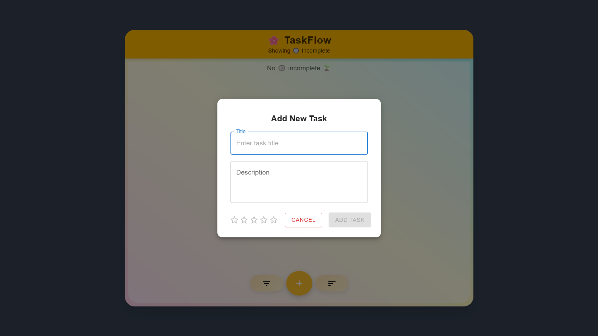
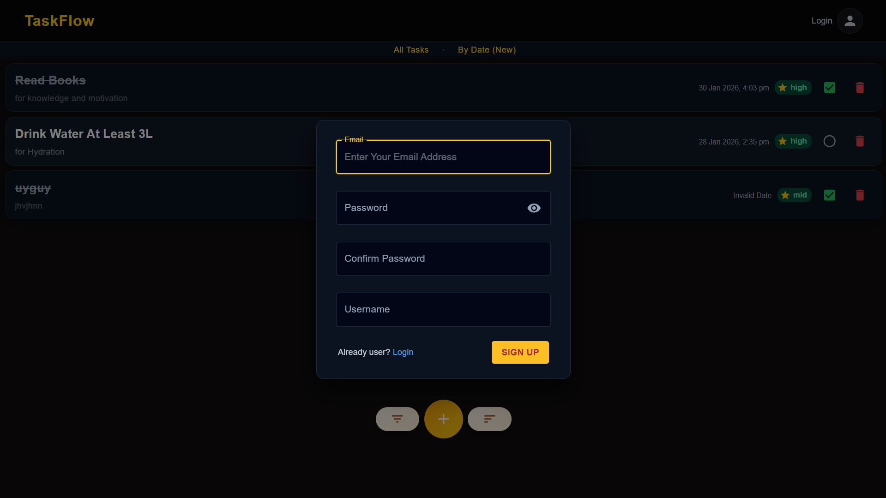
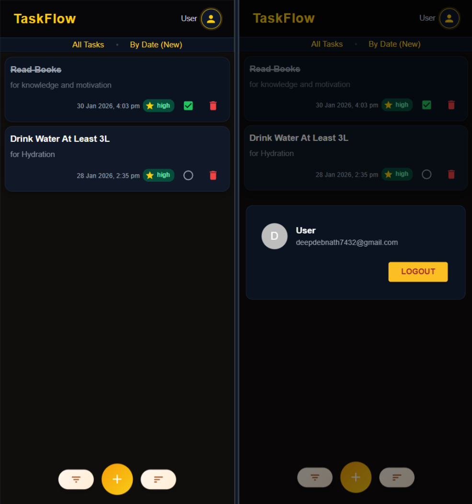

# 🧩 TaskFlow — Workflow Management App

🚀 **Live Demo:** [https://workflow-gilt-five.vercel.app/]

TaskFlow is a modern workflow and task management web application built with **Next.js**, **Tailwind CSS**, **Redux Toolkit**, and **Material UI**, featuring **Firebase** Authentication for secure user access.

Users can sign up, log in, and manage their tasks through an intuitive, responsive interface enhanced with smooth animations powered by **Framer Motion**. Task data is persisted using **localStorage** to ensure fast access and state restoration across sessions.

---

## ✨ Features

### 🔐 Authentication

- Sign up, login, and logout using Firebase Authentication
- Secure user session handling

### 📝 Task Management

- Add, edit, and delete tasks
- Inline task editing
- Mark tasks as completed or incomplete
- Filter tasks by status (all, completed, incomplete)
- Sort tasks by priority

### 🎨 UI & UX

- Modern, responsive UI with Tailwind CSS & Material UI
- Smooth animations using Framer Motion
- Mobile-friendly layout

### 💾 Data Handling

- Persistent task storage using localStorage
- Fast state restoration on reload

### 🧠 State Management

- Centralized state management using Redux Toolkit

---

## 🧰 Tech Stack

- **Next.js 14+ (App Router)**
- **Redux Toolkit**
- **Firebase (Authentication)**
- **Tailwind CSS**
- **Material-UI (MUI)**
- **Framer Motion**
- **localStorage**
- **JavaScript (ES6+)**

---

## 📸 Screenshots





---

## ⚙️ Installation & Setup

```bash
# Clone the repository
git clone https://github.com/Deep-Debnath/workflow

# Navigate to the app directory
cd my-app

# Install dependencies
npm install

# Run the development server
npm run dev
```

Open **http://localhost:3000** in your browser.

---

## 🧭 Roadmap

- ☁️ Cloud task sync using Firebase Firestore
- 👤 User-specific task storage across devices
- 🌓 Dark / Light mode toggle
- 🧪 Unit and integration testing

---

## 🧑‍💻 Author

**Deep Debnath**  
Frontend Developer • React / Next.js / UI / AI Integration

🌐 [Portfolio](https://my-portfolio-7432.vercel.app/)  
💼 [GitHub](https://github.com/Deep-Debnath)
